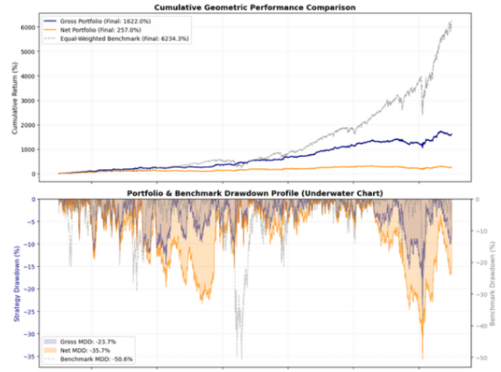

# Statistical-Arbitrage Project

-Backtest of a statstical-arbitrage strategy, loosely based on the work of Avellaneda and Lee in 2010 "Statistical arbitrage in the US
equities market"

-Principal Component Analysis (PCA) with varying number components and mean reversion according to an Ornstein-Uhlenbeck process model

-Also a cost model to demonstrate the detoriation of returns after accounting for friction

-Extreme survivorship bias examaining the current (2026-05) S&P500 companies from 1998 to 2022

